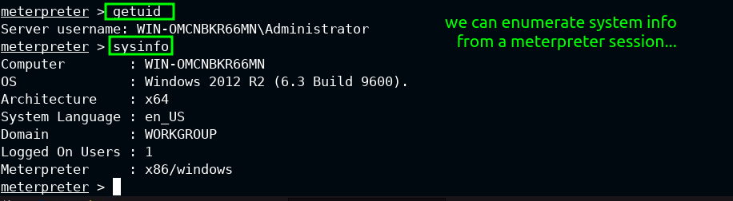
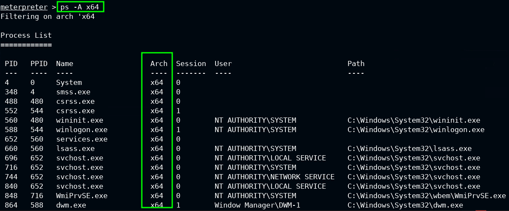

# Enumerating Windows

## Users and Groups

We need to find out which user we have gained access to a target machine as along with the privileges which are associated with that user.

We will also need to enumerate more about the other users on the machine along with the groups they belong to. This is important for the purposes of priv esc. We will want to know which users belong to groups which have elevated privileges such as members of the local administrators group.

We will want to find out the following:

- Current user and privs
- Additional user info (password policy, age, expirty etc)
- Other users on the system / domain
- Groups and group memberships - interesting groups which might have elevated privs
- Members of the built-in Administrator group

Once we know which users belong to interesting groups we can target them for priv esc purposes.

### Meterpreter

From a meterpreter session, we can use `getuid` and `getprivs` or `run post/windows/gather/win_privs` to find out more about the current user and their privileges.

We can also background the session and use `use post/windows/gather/enum_logged_on_users` to find out which other users are logged onto the target machine.

### Cmd Prompt

We can use windows commands to enumerate users and groups.

The command `whoami` lets us know the username. We can also use `echo %USERNAME%`

We can use `whoami /priv` to find out more about the privileges of the current user.

To find out more about other users on the compromised machine, we can use `query user` and `net user` and to find out more about a specific user we can use `net user messi`

The `query user` command will show us users who are logged on - this is important because we might need to be more careful with what we do if we see an admin user logged on as they might detect unusual activity more easily.

To enumerate other users present on a *domain* we can use `net user /domain`

Once we have found usernames for a local machine or a domain, we can iterate through them and run commands to look for interesting data. An example of this is searching for credentials which might have been stored in fields such as the description or comment:

```
for %n in (fcastle,mwatson,SQLService) do net user %n /domain | findstr "pass"
```

To find out which local groups exist on the victim machine, we can use `net localgroup`

We can look for interesting groups as groups can give their members elevated privileges. We can look for members of interesting groups using `net localgroup administrators` We can then potentially target members of these interesting groups for priv esc purposes.

## System Information

When we land on a victim machine, it is important that we take the time to enumerate more about its system. We need this information to help us with other post exploitation activities such as privilege escalation. We will want to know the following:

- Hostname
- OS Name | Windows 10, 11 etc
- OS Build and Service Pack | Windows 7 SP1 7600 for example
- OS Architecture | x64 or x86
- Installed Updates and Hotfixes

This information will help us look for known vulnerabilities and exploits which can be used on the target system.

The architecture will help us if we are developing a priv esc exploit - for compilation purposes - or we are crafting a *meterpreter* session.

The security updates will let us know if it is worth our while working with an exploit or not - it is useless if the vulnerability has been already patched.

### Meterpreter

We can use `getuid` and `sysinfo` to collect useful data from within a *meterpreter* session on the victim machine. These commands will return to us all the data we covered above *except* the installed updates and hot fixes.



### Cmd Prompt

We can gather the necessary data without a meterpreter session by using commands in a cmd terminal.

We can use `hostname` to find the hostname.


An excellent command is `systeminfo` as it will give us all the necessary data *including* the *hotfixes* and more. We can copy the hotfix id numbers and search online to find out more about them so we know which vulnerability the hotfix was patching.


To save time however we can use `wmic qfe get Caption,Description,HotFixID,InstalledOn` to get more data about the hotfixes so we dont have to research them online.

We can focus on the `Security Updates` in the returned data as these are the ones we are interested in.

There are also links to further info about the updates so we will not have to waste our lives using search engines to find the data we want.


>[!TIP]
>It is worth looking for a file called `eula.txt` as it is found on *some* windows systems and contains useful data about the OS - if it is present on the compromised machine it will be found at `C:\Windows\System32\eula.txt`

## Network Information

It is important to enumerate data about networks when we compromise a machine as this will help us potentially *pivot* to other hosts and perhaps networks where we can possibly find more interesting data.

We are mostly interested in finding out about internal networks the machine might be connected to which we are not able to see from an external point of view.

An example of this would be a machine hosting a website which is accessible to the public internet but which is connected to an *internal* network using a different *network interface card* - this internal network is not visible to visitors of the website but can be discovered by an attacker who has compromised the server and is busy enumerating it.

>[!IMPORTANT]
>If new networks are discovered it is important that we enumerate them for new hosts - this will be covered in detail when we explore *pivoting* in a different set of notes - we need to know how to find them first which is what we are covering here

We want to find out about:

- Current IP address and network adapter
- Internal networks if present
- TCP and UDP services which are running along with their respective port numbers
- Other hosts on the *same* network as the compromised machine
- Routing and ARP table data
- Windows firewall state

We can use `ipconfig` and `ipconfig /all` to find out more about the network adapters which the compromised machine is using along with their respective network data such as IPV4 addresses and subnets.

These commands will also show us the IP address of the *defaut gateway* which is responsible for routing traffic on the subnet.


> [!TIP]
> Even if we dont find any other networks it is still important to scan the network the compromised machine is on in order to look for hosts on it which are not visible from an external point of view


We can use `route print` to look at the *routing table* which might show us some interesting or extra routes.


The *arp table* is very useful and well worth looking at - it will show us the IP addresses of machines which the compromised machine has been communicating with using Address Resolution Protocol - this can help us target our further attacks against the network.

The command `arp -a` will show us the *arp table* data.


We can find out more about the tcp and udp services which are running along with their respective ports using `netstat -ano`


When we want to find out about the state of the firewall we can use `netsh advfirewall show allprofiles` - the `help` command can let us know what we can do `netsh advfirewall firewall help`


## Processes and Services

It is important to find out more about the processes, services and scheduled tasks on a compromised machine.

- A process is an instance of a running executable | examples include open web browsers and documents which are being edited
- A service is a process which runs in the background and does not interact with the desktop - aka a daemon as in the original daemons from Greek myth | examples are web servers and print spoolers
- Scheduled tasks are routine tasks which have been automated to run to a set time schedule | examples include making backups of files or running anti-virus scans

### Meterpreter

We can use `ps` from inside a *meterpreter* session to list the running processes on a compromised machine.


We can filter by the *architecture* of the processes using `ps -A x64` for *64 bit* processes and `ps -A x86` for *32 bit* processes.




If we want to find only processes which are running as *NT AUTHORITY/SYSTEM* - the most privileged non-interactive user account - using `ps -s`


>[!NOTE]
>We will only see the *system* processes if we are already operating within the security context of a privileged user

We can combine filter commands - for example if we only want to see *64 bit* processes which are running as *NT AUTHORITY/SYSTEM* we can use `ps -A x64 -s`

We can search by the name of the process using `pgrep explorer.exe`


The *process id* along with its *name* | *architecture* and the *security privileges* it is running under are important to note.

>[!TIP]
>When it comes to *migrating* our *meterpreter* session to a different process we can use `migrate <PID>` - *explorer.exe* is a good stable process to use


### Command Shell

We can use `net start` to see the running *services* and we can get more data about them using `wmic service list brief`


If we want to find the running *processes* along with the *services* which are running under them using `tasklist /SVC`


To look at the *scheduled tasks* we can use `schtasks /query /fo LIST /v` This command returns lots of data so it makes sense to save its output into a *.txt* file.


